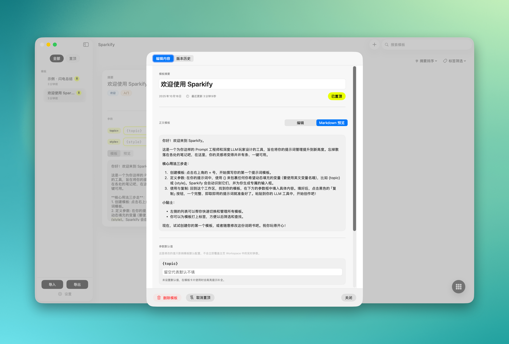

# Sparkify

<div align="center">
  
  <p><strong>A Focused Workspace for Your Prompts</strong></p>
  <p>A native macOS tool for AI prompt management and versioning</p>
  
  <p align="center">
    <a href="README_CN.md">简体中文</a>
  </p>
</div>

---

## Overview

<p align="center">
  
</p>

## 📖 About Sparkify

Sparkify is designed to help you organize and refine your AI prompts. As a native macOS application, it provides a focused, intuitive, and privacy-conscious workspace dedicated to optimizing your prompt engineering workflow.

Whether you're a developer, writer, or AI researcher, Sparkify makes managing your prompts effortless and organized.

## ✨ Core Features

### 🔧 Dynamic Template Engine
Use `{placeholder}` syntax in your prompts to create reusable templates. Set default values for each parameter, enabling quick prompt adjustments across different scenarios.

### 📚 Complete Version History
Every time you modify a template, Sparkify automatically saves a new version. Easily compare any two versions side-by-side, review changes, and restore previous versions anytime. It provides a clear, traceable change history for your prompts.

### 🔗 Agent Context & File Sync
Link your templates directly to local Markdown files (e.g., system instruction documents for command-line agents). Edit content within Sparkify and overwrite files with one click, or sync external file changes back into Sparkify. Keep your templates as the single source of truth, always in sync.

### 🏷️ Tags & Filters
Organize your prompt library with custom tags. Filter by tags, pin status, or keywords to find exactly what you need, instantly.

### 💾 Simple Import & Export
Back up your entire prompt library to a single file. Easily share your collection or migrate between devices.

### 🔒 Clean Experience
Sparkify runs fast, stable, and respects your privacy. All data is stored on your device—we don't collect any information.

## 🚀 Quick Start

1.  **Create a New Template:** Click the `+` button in the main interface or use the shortcut `⌘N` to create a new blank template.
2.  **Edit Content & Placeholders:** In the editor window, enter a title and body for your template. Use `{placeholder}` to define variable parameters, for example: `Write a social media post about {topic}.` Then save the template.
3.  **Fill Parameters:** Return to the main interface, and you'll see an input field named `topic` on the new template card. Fill in your specific content directly on the card, such as: `AI-assisted programming`.
4.  **Copy the Result:** Click the "Copy" button on the card. Sparkify automatically combines your filled parameters with the template and copies the complete prompt (e.g., `Write a social media post about AI-assisted programming.`) to your clipboard.

## 📦 Get Sparkify

### App Store Support Edition

[](https://apps.apple.com/us/app/sparkify/id6753909696)

- ✅ Support ongoing development through purchase
- ✅ Priority access to new features and updates
- ✅ Complete technical support

### Community Edition

The Community Edition offers the same core functionality as the Support Edition, completely free.

- 📥 [Download the latest version from GitHub Releases](https://github.com/SkyPixel-Studio/Sparkify/releases)
- ⏱️ Usually updated some time after the App Store version release
- 🔓 Source code is always up-to-date

> **Note:** The source code in this repository is usually ahead of the Community Edition builds in GitHub Releases, but maintains feature parity with the App Store Support Edition.

## 🔨 Development Guide

### Building the Project

```bash
# Clone the repository
git clone https://github.com/SkyPixel-Studio/Sparkify.git
cd Sparkify

# Build
xcodebuild -scheme Sparkify -destination 'platform=macOS' build

# Run tests
xcodebuild -scheme Sparkify -destination 'platform=macOS' test

# Open in Xcode
xed .
```

### Code Standards

- **Indentation:** 4 spaces
- **Naming Conventions:**
  - View structs end with `View` (e.g., `TemplateCardView`)
  - Models use PascalCase (e.g., `PromptItem`)
  - Properties use lowerCamelCase
- **Commit Messages:** Follow `type: scope` format
  - Example: `feat: add version comparison view`
  - Example: `fix: resolve template parsing escape issue`

### Testing Requirements

- Test files mirror source file paths (e.g., `TemplateEngine.swift` ↔︎ `TemplateEngineTests.swift`)
- Test naming follows `testScenarioExpectation` pattern
- All tests must pass before submitting PR: `xcodebuild -scheme Sparkify test`

## 🤝 Contributing

We welcome community contributions!

### How to Contribute

1. **Fork the repository** and create your feature branch (`git checkout -b feat/amazing-feature`)
2. **Write code** and ensure it follows the project's code standards
3. **Add tests** covering new features or bug fixes
4. **Run full test suite** to ensure nothing is broken
5. **Commit changes** (`git commit -m 'feat: add amazing feature'`)
6. **Push to branch** (`git push origin feat/amazing-feature`)
7. **Create a Pull Request**

### PR Checklist

- [ ] Code passes `xcodebuild ... build`
- [ ] All tests pass `xcodebuild ... test`
- [ ] UI changes include screenshots or recordings
- [ ] Relevant documentation updated
- [ ] Commit messages follow conventions


## 📄 License

This project is licensed under the [Apache License 2.0](LICENSE.md).

You are free to use, modify, and distribute this software for personal or commercial purposes, as long as you comply with the license terms.

## 🙏 Acknowledgments

Sparkify is maintained by **Guangzhou Meirui Overseas Consultancy Services Co., Ltd.** (广州美瑞海外咨询有限公司).

Thanks to all users and contributors who support this project. Your feedback and contributions make Sparkify better.

---

<div align="center">
  <p>Bring clarity to your creative process</p>
  <p><strong>Download Sparkify now and refine your AI workflow</strong></p>
</div>
